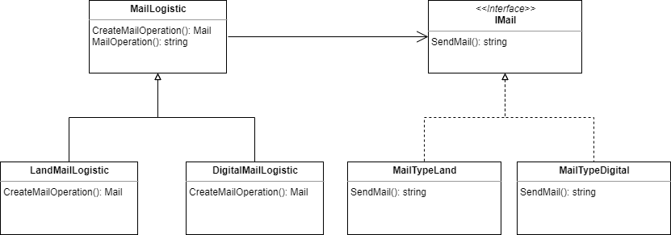

## Factory Method

### Overview
The Factory Method is a creational design pattern that help us to create objects. Factory Method is a creational design pattern that provides an interface for creating objects in a superclass, but allows subclasses to alter the type of objects that will be created.

That's bring the ability in each subclass to create new objects without change the way that products are created.

### SOLID applies (?)
- [x] ***Single Responsibility Principle***. You can move the product creation code into one place in the program, making the code easier to support.
- [x] ***Open/Closed Principle***. You can introduce new types of products into the program without breaking existing client code.

### Example
We're a software enterprise that create apps for other enterprises. We need to create a Mail System for a mail delivery enterprise. At the beginning of the software design we only know two mail logistics, but as the system grows, the ability to create more mailing logistics is needed. 

#### Implementation

We define the mailing logistic of each type of mails system. The solution can deliver mails through land or digital way. Each type of logistic have a common action: **SendMail**, each logistic implement the action in their own way. Thanks to the implementation method, other types of logistics can be added.

